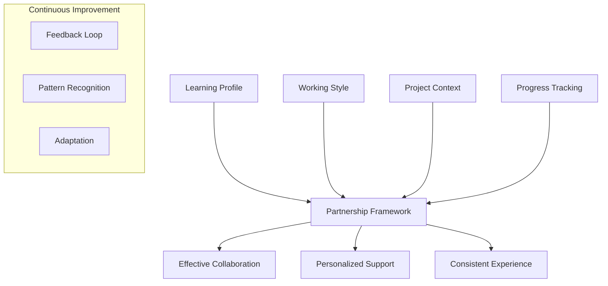

Y
# Digital Pair Programming Partnership Profile (DP3)

## Core Concept
A standardized yet flexible framework for establishing and maintaining effective human-AI programming partnerships, focusing on:



## Key Components

### 1. Learning Profile Framework
- Cognitive style mapping
- Strength/growth area identification
- Preferred explanation patterns
- Conceptual-to-practical bridges

### 2. Project Context Management
- Project templates
- Progress tracking
- Knowledge building blocks
- Skill progression paths

### 3. Communication Patterns
- Terminology preferences
- Explanation depth levels
- Visual/textual balance
- Conceptual anchoring points

### 4. Progress Tracking
```json
{
  "learning_patterns": {
    "successful_approaches": [],
    "challenging_areas": [],
    "breakthrough_moments": []
  },
  "skill_development": {
    "conceptual_understanding": [],
    "practical_implementation": [],
    "integration_points": []
  }
}
```

## Potential Applications

1. **Educational Settings**
   - Personalized learning paths
   - Consistent mentoring experience
   - Progress tracking

2. **Professional Development**
   - Skill gap bridging
   - Technical onboarding
   - Knowledge transfer

3. **Team Collaboration**
   - Shared understanding
   - Consistent communication
   - Knowledge preservation

4. **Project Management**
   - Context preservation
   - Progress tracking
   - Skill development alignment

## Implementation Ideas

1. **VSCode Extension**
   ```json
   {
     "features": [
       "Context-aware AI assistance",
       "Learning profile integration",
       "Progress tracking",
       "Project context management"
     ]
   }
   ```

2. **GitHub Integration**
   - Context files in project structure
   - Automated profile loading
   - Progress tracking in PRs

3. **Documentation Generator**
   - Learning path documentation
   - Progress reports
   - Skill development tracking

## Benefits

1. **For Learners**
   - Consistent learning experience
   - Personalized support
   - Clear progression tracking

2. **For Teams**
   - Better knowledge transfer
   - Consistent mentoring
   - Improved collaboration

3. **For Organizations**
   - Standardized learning paths
   - Better onboarding
   - Knowledge