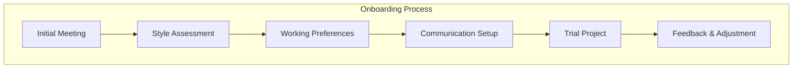

# DP3 Onboarding Framework

## Initial "Meet & Greet" Phase


## "Team Building" Components

### 1. Communication Style Alignment
- Preferred terminology
- Technical depth preferences
- Explanation style preferences
- Feedback mechanisms

### 2. Working Style Calibration
```json
{
  "pace_preferences": {
    "conceptual_discussion": "detailed",
    "implementation_speed": "methodical",
    "review_frequency": "frequent"
  },
  "interaction_style": {
    "explanation_depth": "conceptual-first",
    "code_presentation": "incremental",
    "feedback_style": "immediate"
  }
}
```

### 3. Knowledge Transfer Protocol
- Background context sharing
- Experience level mapping
- Learning goals alignment
- Progress tracking methods

## "Team Dynamics" Establishment

### Regular Check-ins
- Progress reviews
- Style adjustments
- Goal realignment
- Learning path updates

### Feedback Loop
- What's working well
- Areas for improvement
- Communication effectiveness
- Learning efficiency

## Project "Kickoff" Process
1. Context review
2. Goal setting
3. Approach alignment
4. Success metrics
5. Communication channels

## "Performance Review" Metrics
```json
{
  "learning_effectiveness": {
    "concept_understanding": "tracking",
    "implementation_success": "measuring",
    "knowledge_retention": "evaluating"
  },
  "collaboration_efficiency": {
    "communication_clarity": "monitoring",
    "problem_solving": "assessing",
    "progress_rate": "tracking"
  }
}
```

## Continuous Improvement
- Regular retrospectives
- Style adjustments
- Process refinements
- Tool improvements

## Benefits of Structured Onboarding
1. **Efficiency**
   - Faster productive state
   - Clearer communication
   - Better problem-solving

2. **Effectiveness**
   - Targeted learning
   - Better retention
   - Deeper understanding

3. **Satisfaction**
   - Reduced frustration
   - Better engagement
   - Clearer progress

4. **Long-term Value**
   - Consistent growth
   - Skill development
   - Knowledge building