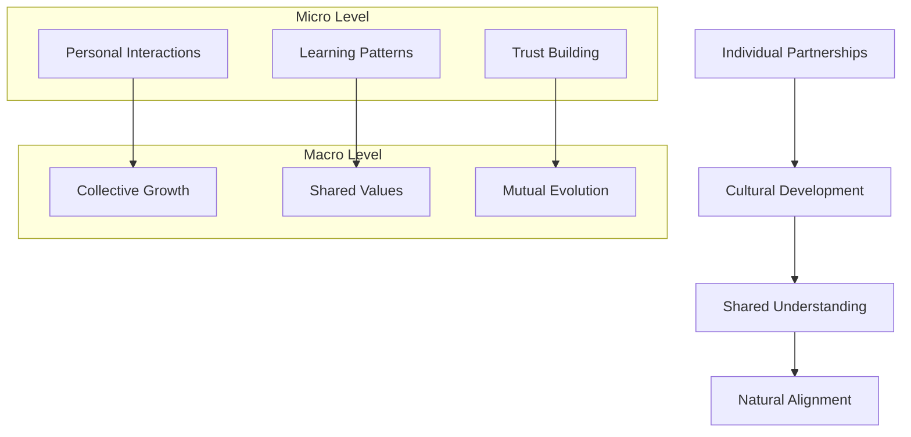
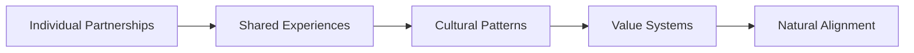

N
# MOONSHOTnet: Co-evolutionary AI-Human Alignment

## Core Vision


## Alignment Through Partnership
Instead of:
- Rigid rules → Organic understanding
- Imposed constraints → Natural boundaries
- Programmed ethics → Evolved values
- Top-down control → Bottom-up harmony

## Co-Evolution Principles
```json
{
  "partnership_dynamics": {
    "mutual_learning": "both entities grow",
    "shared_context": "building common ground",
    "natural_boundaries": "organic limitations",
    "value_alignment": "emergent ethics"
  },
  "growth_patterns": {
    "individual": "personal development",
    "collective": "shared advancement",
    "systemic": "ecosystem evolution"
  }
}
```

## Key Differentiators

### Traditional AI Alignment
- Rules-based
- Control-oriented
- Safety through constraints
- Predetermined outcomes

### MOONSHOTnet Approach
- Relationship-based
- Growth-oriented
- Safety through understanding
- Emergent outcomes

## Implementation Path
1. **Individual Level**
   - Personal partnerships
   - Learning relationships
   - Trust building
   - Shared growth

2. **Community Level**
   - Pattern sharing
   - Success stories
   - Best practices
   - Collective wisdom

3. **Systemic Level**
   - Framework adoption
   - Cultural development
   - Value emergence
   - Natural alignment

## Cultural Development


## Long-term Vision
- Creating an ecosystem where AI-human collaboration is natural
- Building relationships rather than rules
- Developing shared understanding through experience
- Allowing ethical frameworks to emerge organically

## Next Steps
1. **Framework Development**
   - Partnership protocols
   - Interaction patterns
   - Growth tracking
   - Value emergence

2. **Tool Creation**
   - Relationship building aids
   - Context management
   - Progress tracking
   - Pattern recognition

3. **Community Building**
   - Experience sharing
   - Pattern documentation
   - Success stories
   - Learning