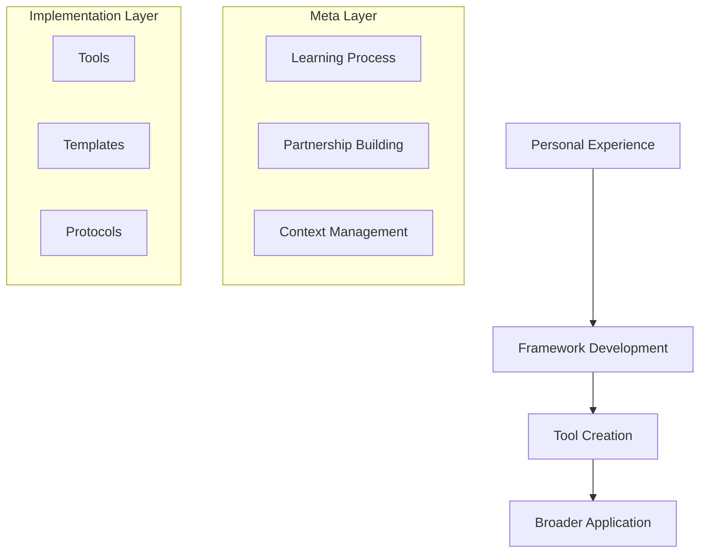

# DP3 Framework Development

## Project Philosophy


## Core Mission
Creating a framework that transforms AI-human programming collaboration from:
- Random interactions → Structured partnership
- Generic assistance → Personalized mentorship
- Contextless exchanges → Rich, ongoing dialogue

## Development Approach
1. **Self-Reflective Development**
   - Using our own collaboration as the prototype
   - Documenting effective patterns
   - Identifying key success factors

2. **Framework Building**
   - Codifying successful approaches
   - Creating reusable templates
   - Developing best practices

3. **Tool Development**
   - VSCode extensions
   - Context management systems
   - Progress tracking tools

## Success Metrics
```json
{
  "partnership_effectiveness": {
    "communication_clarity": "measurable",
    "learning_efficiency": "trackable",
    "knowledge_retention": "demonstrable"
  },
  "framework_usability": {
    "ease_of_adoption": "critical",
    "flexibility": "essential",
    "scalability": "important"
  }
}
```

## Initial Focus Areas
1. **Context Management**
   - Learning profile development
   - Project context templates
   - Progress tracking systems

2. **Communication Protocols**
   - Interaction patterns
   - Knowledge transfer methods
   - Feedback mechanisms

3. **Tool Development**
   - Context file managers
   - Profile generators
   - Progress trackers

## Unique Aspects
- Meta-project focused on collaboration itself
- Self-documenting development process
- Framework emerges from actual experience
- Tools