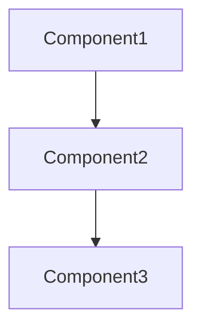

# Project Context Template

## Project Information
```json
{
  "name": "[PROJECT_NAME]",
  "status": "[STATUS]",
  "start_date": "[DATE]",
  "focus": "[MAIN_FOCUS]",
  "key_concepts": [
    "concept1",
    "concept2"
  ],
  "learning_goals": [
    "goal1",
    "goal2"
  ]
}
```

## Technical Stack
- Framework: 
- Key Libraries:
- Development Tools:

## Architecture Overview


## Learning Progress
- [ ] Concept 1
- [ ] Concept 2
- [ ] Implementation 1
- [ ] Implementation 2

## Notes
- Important observations
- Key challenges
- Solutions attempted
</boltAction