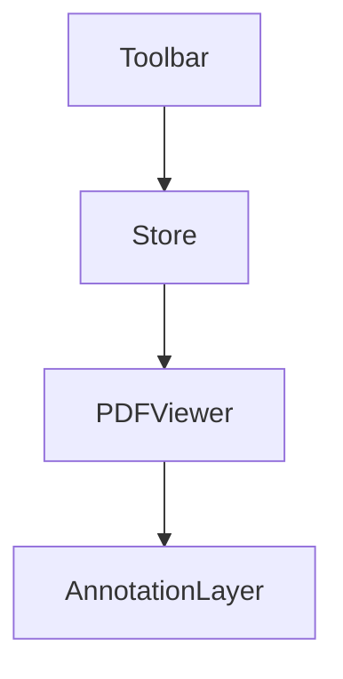

# Pianassist Project Context

## Project Information
```json
{
  "name": "Pianassist",
  "status": "in-progress",
  "start_date": "2024-01-21",
  "focus": "PDF manipulation and annotation",
  "key_concepts": [
    "PDF rendering",
    "Web Workers",
    "State management",
    "Component architecture"
  ],
  "learning_goals": [
    "Understanding worker thread implementation",
    "State management patterns",
    "Component lifecycle and relationships"
  ]
}
```

## Technical Stack
- Framework: React + Vite
- Key Libraries: react-pdf, zustand, tailwindcss
- Development Tools: WebContainer environment

## Architecture Overview


## Learning Progress
- [x] Project setup and configuration
- [x] PDF viewer implementation
- [ ] Worker thread configuration
- [ ] Annotation system
- [ ] State management optimization

## Notes
- Challenges with Web Worker CORS configuration
- Exploring alternative PDF rendering approaches
- Focus on clean component architecture