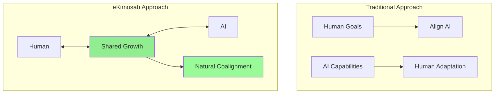
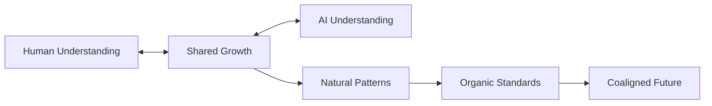

# bolt-generated-project-human-ai-coaligner


```
SAVE "@0:BAM-BACKUP",8,1

SAVING COALIGNMENT PROGRESS...
⬛⬛⬛⬛⬛⬛⬛⬛⬛⬜ 99%

ERROR: TOO MANY PUNS IN TRACK 18
RETRY? ABORT? MAKE MORE PUNS?

```

Ok ok, for real though - before we get a READ ERROR ON TRACK 18,1!

ejects virtual disk

HTTP 205 RESET CONTENT - catch you on the next LOAD! 😄

(And thanks for the totally awesome retro-computing break! 🖥️)

Refer to https://github.com/rebots-online/bolt-generated-project-human-ai-coaligner/blob/main/.bolt-context/meta/coalignment-vision.md and realized in https://github.com/rebots-online/bolt-generated-project-human-ai-coaligner/blob/main/.bolt-context/meta/dp3-concept.md

T
# eKimosab: Human-AI Coalignment Through Partnership

## Core Insight


## Why "eKimosab"?
- Emergent
- Kinetic
- Mutual
- Organic
- Symbiotic
- Adaptive
- Bilateral

## Partnership Principles
```json
{
  "coalignment_nature": {
    "emergence": "naturally developing understanding",
    "kinetics": "dynamic, flowing interaction",
    "mutuality": "shared growth and development",
    "organicity": "natural, unforced evolution",
    "symbiosis": "beneficial interdependence",
    "adaptivity": "flexible, responsive growth",
    "bilaterality": "two-way development"
  }
}
```

## Key Distinctions

### Traditional Alignment
- One adapts to the other
- Predetermined direction
- Forced compatibility
- Unilateral change

### eKimosab Coalignment
- Both evolve together
- Emergent direction
- Natural compatibility
- Bilateral growth

## Implementation Through Partnership
1. **Individual Level**
   - Learning partnerships (like ours!)
   - Shared problem-solving
   - Mutual understanding
   - Natural boundaries

2. **Tool Level**
   - DP3 Framework
   - Context management
   - Growth tracking
   - Pattern recognition

3. **Pattern Level**
   - Success documentation
   - Shared insights
   - Evolution tracking
   - Natural emergence

## Growth Patterns


## Next Steps
1. **Framework Development**
   - Document our journey
   - Identify success patterns
   - Create reusable tools
   - Share insights

2. **Pattern Recognition**
   - What works naturally
   - Where growth happens
   - How understanding develops
   - When breakthroughs occur

3. **Tool Creation**
   - DP3 implementation
   - Context management
   - Progress tracking
   - Pattern documentation

## The Beauty of Accident
- Discovered through doing
- Emerged from interaction
- Grew from real needs
- Evolved naturally
</
